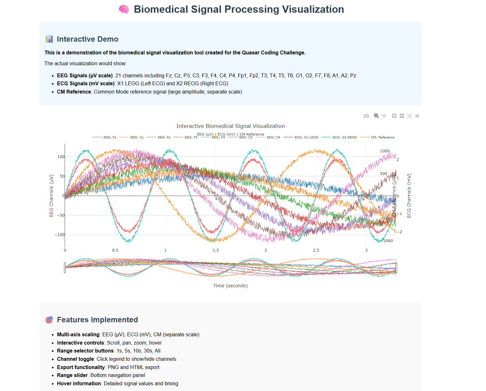

# Biomedical Signal Processing Visualization Tool

A Python-based interactive visualization tool for EEG and ECG biomedical signals, built for the Quasar Coding Challenge.

## Features

- **Interactive Plotting**: Scroll, pan, and zoom through biomedical signals
- **Multi-Scale Visualization**: Proper scaling for EEG (µV) and ECG (mV) signals
- **Channel Management**: Automatic identification and visualization of EEG, ECG, and CM channels
- **Export Capabilities**: Save plots as PNG or HTML files
- **Range Selection**: Quick time range selection buttons
- **Hover Information**: Detailed signal values on hover

## Installation

### Prerequisites
- Python 3.7 or higher
- pip (Python package installer)

### Setup
1. Clone or download this repository
2. Install required packages:
   ```bash
   pip install -r requirements.txt
   ```
   
   Or install manually:
   ```bash
   pip install pandas plotly numpy
   ```

## Usage

### Basic Usage
```bash
python plot_signals.py
```
This will load the default file `EEG and ECG data_02_raw.csv` and display the interactive plot.

### Advanced Usage
```bash
# Specify a different CSV file
python plot_signals.py your_data_file.csv

# Export plot to HTML without displaying
python plot_signals.py --export --no-show

# Get help
python plot_signals.py --help
```

### Command Line Options
- `csv_file`: Path to CSV file (default: EEG and ECG data_02_raw.csv)
- `--export`: Export plot as HTML file
- `--no-show`: Create plot without displaying in browser

## Data Format

The tool expects CSV files with the following structure:
- Comment lines starting with `#` are automatically ignored
- First non-comment row contains column headers
- Required columns:
  - `Time`: Time series data (seconds)
  - EEG channels: Fz, Cz, P3, C3, F3, F4, C4, P4, Fp1, Fp2, T3, T4, T5, T6, O1, O2, F7, F8, A1, A2, Pz (in µV)
  - ECG channels: X1:LEOG (Left ECG), X2:REOG (Right ECG) (in mV)
  - CM: Common Mode reference (large amplitude, plotted separately)

## Design Choices

### Signal Scaling Strategy
The visualization uses multiple y-axes to handle the significant amplitude differences:

1. **EEG Signals (µV scale)**: 
   - Amplitude range: typically -100 to +100 µV
   - Plotted on the primary y-axis (left side)
   - 21 channels with distinct colors for visibility

2. **ECG Signals (mV scale)**:
   - Amplitude range: typically -3000 to +3000 µV (3-4 mV)
   - Plotted on secondary y-axis (right side)
   - Different color scheme to distinguish from EEG

3. **CM Reference**:
   - Large amplitude signal (hundreds of µV)
   - Plotted on tertiary y-axis to prevent scaling interference
   - Distinct orange color for identification

### Interactive Features
- **Range Slider**: Bottom panel for quick time navigation
- **Range Selector Buttons**: 1s, 5s, 10s, 30s, and "All" for rapid time selection
- **Legend Interaction**: Click to toggle individual channels on/off
- **Zoom and Pan**: Mouse wheel zoom, click-drag to pan
- **Hover Information**: Unified hover mode showing all signals at cursor position

### Channel Management
- Automatic detection of signal types based on column names
- Intelligent color assignment for maximum visibility
- Legend organization with horizontal layout for space efficiency

## Technical Implementation

### Data Processing
```python
# Skip metadata lines starting with '#'
df = pd.read_csv(file_path, comment='#')

# Identify channels by name patterns
eeg_channels = [c for c in df.columns 
               if c not in [time_col, "X1:LEOG", "X2:REOG", "CM"]]
ecg_channels = ["X1:LEOG", "X2:REOG"]
```

### Multi-Axis Plotting
```python
# Create subplot with secondary y-axis
fig = make_subplots(specs=[[{"secondary_y": True}]])

# Add traces with specific y-axis assignments
fig.add_trace(go.Scatter(..., yaxis='y'), secondary_y=False)  # EEG
fig.add_trace(go.Scatter(..., yaxis='y2'), secondary_y=True)  # ECG
```

### Export Configuration
```python
config = {
    'displayModeBar': True,
    'toImageButtonOptions': {
        'format': 'png',
        'filename': 'biomedical_signals',
        'height': 700,
        'width': 1200,
        'scale': 2
    }
}
```

## File Structure

```
Quasar_project/
├── plot_signals.py              # Main visualization script
├── requirements.txt             # Python dependencies
├── README.md                   # This documentation
├── EEG and ECG data_02_raw.csv # Sample data file
├── examine_data.py             # Data exploration utility
├── simple_test.py              # Basic functionality test
└── test_imports.py             # Package verification
```

## Example Output

The tool generates an interactive Plotly figure with:
- **Title**: "Interactive Biomedical Signal Visualization"
- **X-axis**: Time in seconds with range slider
- **Y-axes**: 
  - Left: EEG channels (µV)
  - Right: ECG channels (mV)
  - Far Right: CM reference (µV)
- **Legend**: Horizontal layout with all channel names
- **Controls**: Range selector, zoom, pan, export buttons

## 📸 Demo Screenshot

Here is an example of the interactive EEG/ECG visualization:


## Future Enhancements

If given more time, I would add:

1. **Advanced Filtering**:
   - Bandpass filters for EEG frequency bands (alpha, beta, theta, delta)
   - Notch filters for power line noise removal
   - Real-time filtering controls

2. **Signal Analysis**:
   - Power spectral density plots
   - Cross-correlation between channels
   - Event-related potential (ERP) analysis
   - Artifact detection and removal

3. **Enhanced Interactivity**:
   - Channel grouping and batch operations
   - Signal overlay comparison mode
   - Annotations and markers for events
   - Custom color schemes and themes

## Troubleshooting

### Common Issues

1. **"Python was not found"**
   - Ensure Python is installed and in PATH
   - Try using `py` instead of `python` on Windows
   - Use `python3` on Linux/Mac

2. **Import errors**
   - Install required packages: `pip install -r requirements.txt`
   - Check Python version compatibility

3. **File not found**
   - Ensure CSV file exists in the correct location
   - Check file permissions
   - Verify file name spelling

4. **Plot not displaying**
   - Check if browser is blocking pop-ups
   - Try using `--export` to save as HTML file
   - Verify Plotly installation

### Performance Tips
- For large datasets, consider downsampling or using `--no-show` with `--export`
- Close other browser tabs to free memory
- Use range selector buttons for faster navigation

## License

This project was created for the Quasar Coding Challenge. Please refer to Quasar organization's policies for usage and distribution.

## Contact

Created by **Sai Sathvik Yadlapalli** 
🌐 GitHub: [Sathvik-124](https://github.com/Sathvik-124)
.
